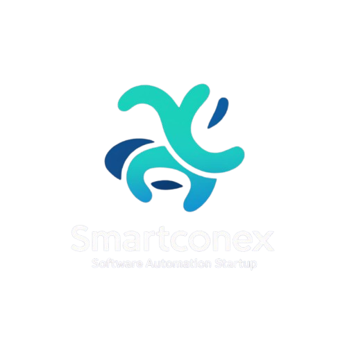
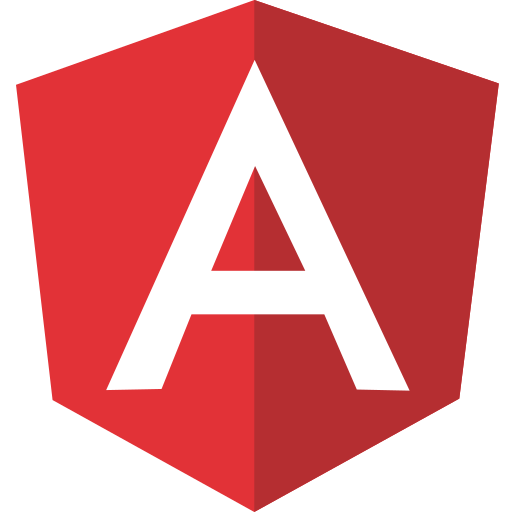
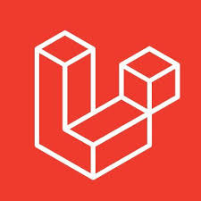
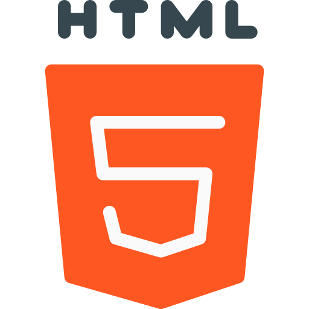
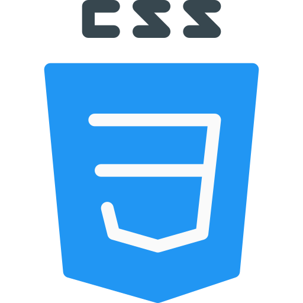

# smartconex

>Hi, I'm **Alberto Godoy**, CEO and Founder of smartconex, and a Developer at Gamargo Law. As a specialist in custom software development and automation with over 5 years of experience, I've built a team dedicated to creating innovative digital solutions.
>
>My journey in software engineering has allowed me to cultivate solid skills with cutting-edge frameworks and technologies such as Angular, Next.js, Node.js, and Laravel (including Filament). My expertise extends to relational databases, particularly PostgreSQL and MySQL, while my proficiency in TypeScript, JavaScript, PHP, and C has been fundamental to the success of our projects. I also specialize in building robust interfaces using Ng-Zorro, configuring workflows with Postman, creating automations via n8n, and managing efficient deployments on Railway. Throughout my career, I've led innovative projects ranging from CRM systems to complex lottery management architectures, consolidating my experience across various areas of software development.
>
>At smartconex, we're committed to delivering exceptional digital experiences through technical excellence and creative problem-solving.
>
>**Technologies & Tools we use:**
>
><code></code>
><code></code>
><code></code>
><code></code>
><code></code>
><code></code>
><code></code>
><code></code>
><code></code>
><code></code>
><code></code>
><code></code>
><code></code>

>## 📫 Connect with us:
>
>   - 🌐 **[smartconex Website](#)** *(Add your smartconex URL here)*
>   -  **[Gmail](https://mail.google.com/mail/u/0/?tab=rm&ogbl#inbox?compose=CllgCJTMXPWxHXqTpZxNtXwdpsnCKDhzCxBXdRzfNlzSmhQksTbwSJgLkNZLJKBptKpDkTvkvjV)**